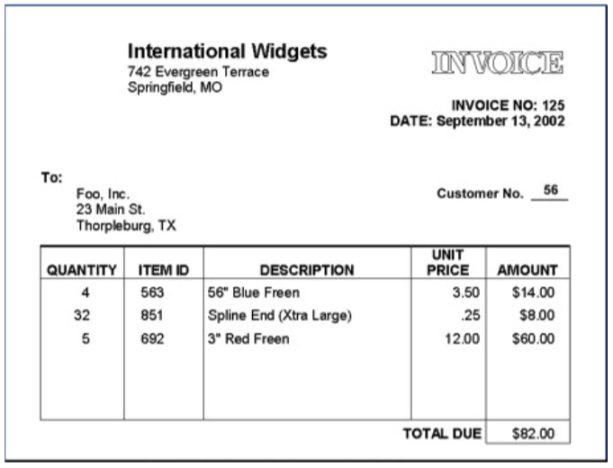

# RLCodingTest
Link for documentation: [Documentation](https://scottawalters.github.io/RLTest/)

## Problem 1
Provided test case hardcoded into main method in order to verify data.  Output as follows:

```
Invoice
InvoiceNum=125
date=September 13, 2002
[client=
Client [customerNo=56, address=Address [line1=Foo, Inc., line2=23 Main St., city=Thorpleburg, state=TX]]
[company=
Company [address=Address [line1=International Widgets, line2=742 Evergreen Terrace, city=Springfield, state=MO]]
items=[
Item [quantity=4, itemId=563, description=56" Blue Freen, unitPrice=3.5, getLineSum()=14.0], 
Item [quantity=32, itemId=851, description=Spline End (Xtra Large), unitPrice=0.25, getLineSum()=8.0], 
Item [quantity=5, itemId=692, description=3" Red Freen, unitPrice=12.0, getLineSum()=60.0]]
getInvoiceSum()=82.0]
```



## Problem 2

Run with '[Testfile.txt](./Testfile.txt) 10' as parameters.  The Testfile.txt file is also provided here on GitHub.  These inputs match the test case given.  Sample Output:

```
This is a 
great job.
  I love  
programmi-
ng and th-
e challen-
ges it br-
ings.  So-
lving pro-
blems is  
what I lo-
ve to do.
```

The sample output was actually missing the L in the word Solving, so the end of my output looks a little different than the provided sample in the last 4 lines, but is correct based on the provided input text.  Altering the sample input file to remove the L, my output also matches the provided sample output.

## Problem 3

Requires the height/number of stories as an input parameter.  For a height of 3, provides the following output for the possible numbers of configurations.  Also tested for a height of 5.  After working on this and having a less elegant [initial solution](https://github.com/scottawalters/RLTest/blob/898e3f286101ec83166f56ec39a49d172f69f7e7/src/problem3/CalculateArrangements.java), it became obvious this was basically just the Fibonacci sequence.

```
3
```
